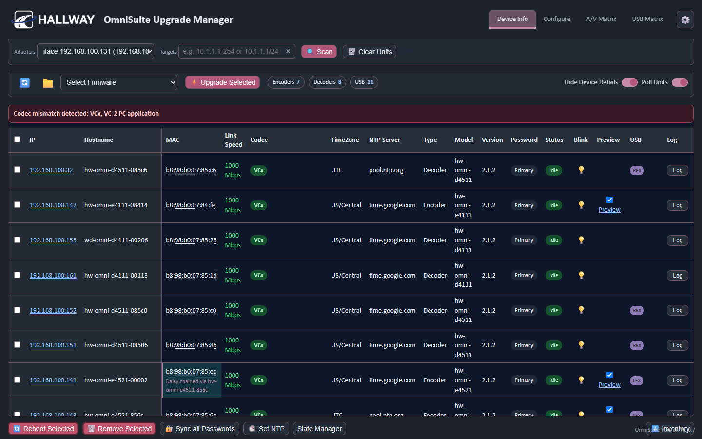
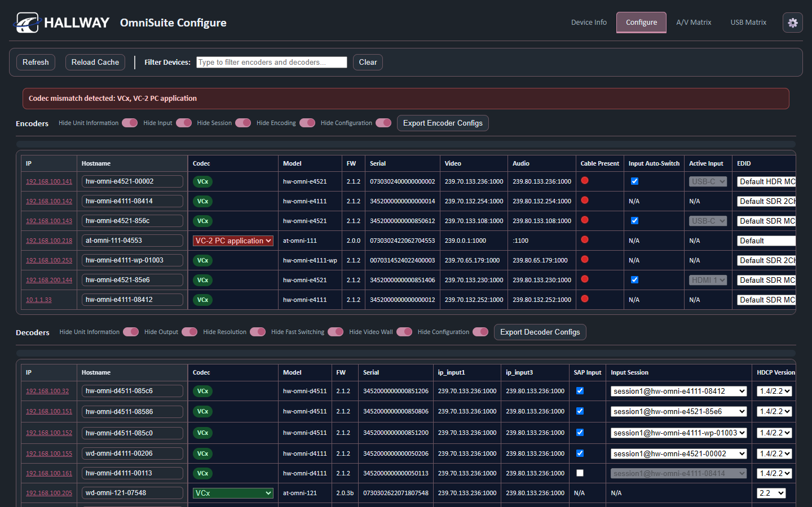
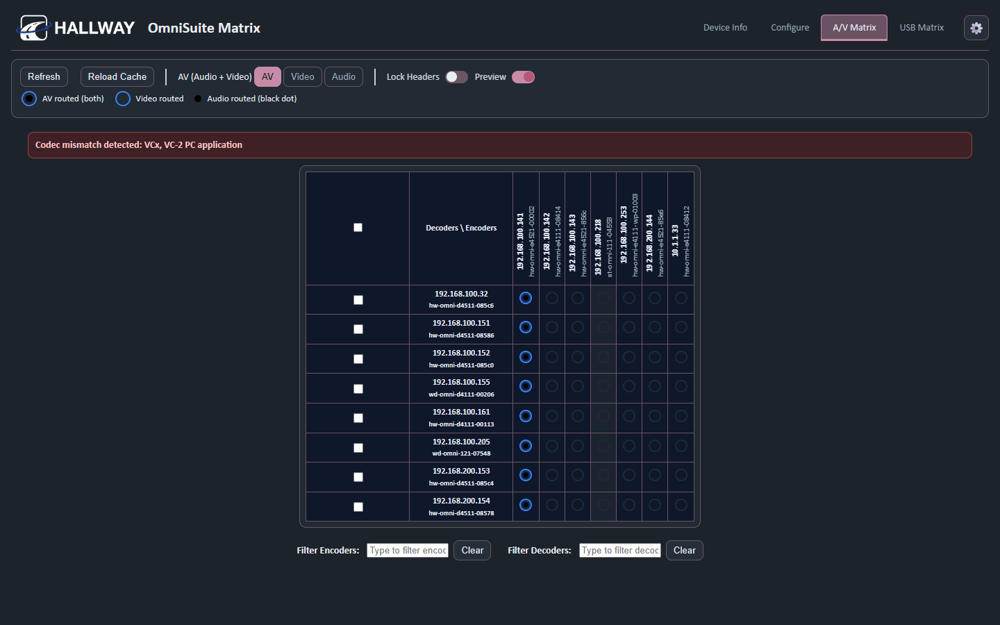
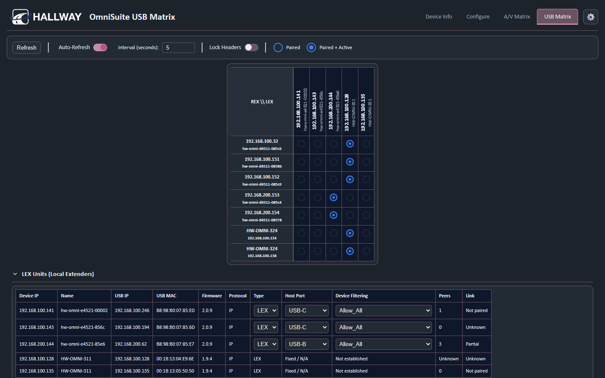
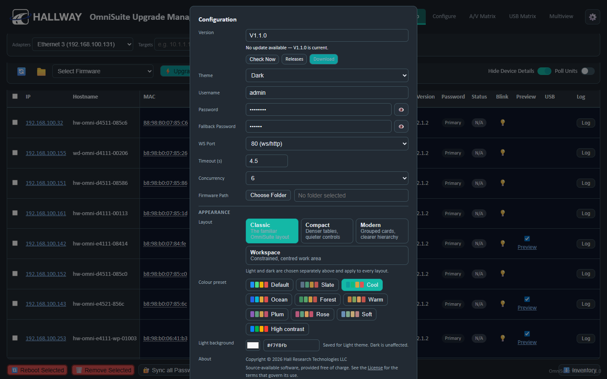
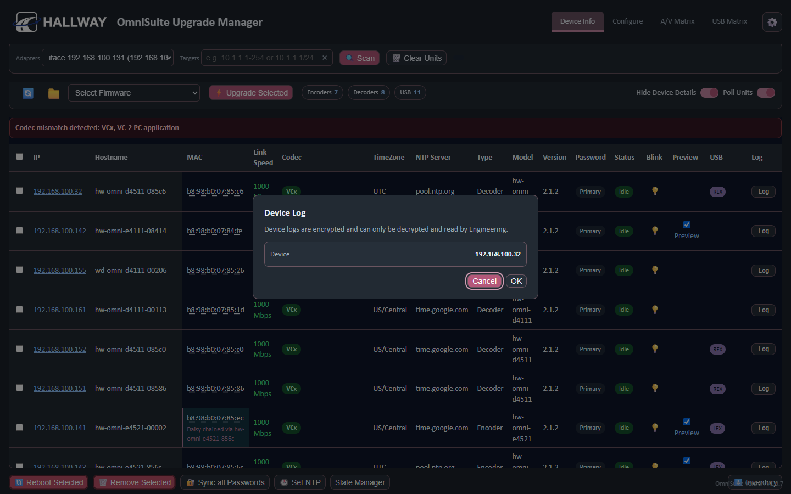

# OmniSuite

A management application for Atlona and Hall Research **OmniStream** AV-over-IP
encoders and decoders, and for the **HW-OMNI-311 / HW-OMNI-324** USB extenders
and the Icron USB endpoints built into E4521 and D4511 units.

OmniSuite runs on the management PC, talks to each device directly, and presents
one inventory: discovery, configuration, A/V routing, USB routing, firmware,
diagnostics and reporting.

**Version: V1.0.7**

---

## Highlights

- **One discovery console.** Pick the adapter, scan, and every page works from
  the same inventory. Devices are identified by MAC, so a unit that changes
  address updates its existing row instead of appearing twice.
- **Encoder and decoder configuration** — inputs, EDID, HDCP, sessions,
  encoding, resolution, fast switching, video wall, hostnames, NTP, per-unit
  config export and import.
- **A/V Matrix** — encoders across the top, decoders down the side, with
  separate AV, Video and Audio routing modes.
- **USB Matrix** — LEX and REX endpoints with one-click routing. Clicking a cell
  states the relationship you want and OmniSuite reconciles the hardware to it;
  there is no unpair-then-pair step to perform.
- **Standalone HW-OMNI-311 / HW-OMNI-324 discovery** over their own UDP
  protocol, alongside **integrated Icron endpoints** discovered through their
  parent OmniStream unit — one row per physical endpoint either way.
- **Multi-peer USB.** One host can hold several remote peers; adding or removing
  one leaves the others alone.
- **Same-subnet safety.** A USB pairing across different subnets does not work,
  so OmniSuite refuses to create one and says why. The check fails closed and
  never tears down a working route.
- **LLDP topology awareness** — which switch each device is attached to, with
  advisories when the fleet spans more than one switch or when a unit is daisy
  chained behind another.
- **Inventory export** to a two-sheet XLSX workbook, and a **TS Dump** JSON file
  for support with passwords masked.
- **Encrypted device logs** collected on request for manufacturer Engineering.
- **Appearance** — light and dark, ten colour presets, four layouts.
- **Update notification** — OmniSuite tells you when a newer release exists. It
  never downloads or installs anything for you.

---

## Screenshots

| | |
|---|---|
| **Device Info** — the fleet, with frozen identity columns and per-row actions | **Configure** — encoder, decoder and USB settings |
|  |  |
| **A/V Matrix** — encoders to decoders, with AV / Video / Audio modes | **USB Matrix** — LEX hosts to REX devices |
|  |  |
| **Settings** — version, credentials, appearance | **Device Log** — the Engineering notice shown before any log is collected |
|  |  |

The bundled [User Guide](ui/user-guide.html) is also
[pictured](docs/images/user-guide.png).

---

## Downloads

Get the archive for your machine from the
[Releases page](https://github.com/Hall-Research-Technologies/OmniSuite/releases).

| Platform | Artifact |
|---|---|
| Windows x86-64 | `OmniSuite-V1.0.7-Windows-x86_64.zip` |
| macOS Apple Silicon | `OmniSuite-V1.0.7-macOS-arm64.zip` |
| macOS Intel | `OmniSuite-V1.0.7-macOS-x86_64.zip` |
| Ubuntu Linux x86-64 | `OmniSuite-V1.0.7-Ubuntu-x86_64.tar.gz` |

Each release also carries `SHA256SUMS.txt`. To check a download:

```bash
sha256sum -c SHA256SUMS.txt          # Linux / macOS
```
```powershell
Get-FileHash .\OmniSuite-V1.0.7-Windows-x86_64.zip -Algorithm SHA256
```

See **[Supported platforms](#supported-platforms)** below for what has actually
been tested on each one — the levels are not the same.

---

## Getting started

1. **Download** the archive for your platform and extract it.
2. **Launch OmniSuite.**
   - Windows: run `OmniSuite.exe`.
   - macOS: open `OmniSuite.app`. It is **not signed or notarised**, so the
     first launch needs right-click → Open (see
     [Supported platforms](#supported-platforms)).
   - Ubuntu: run `./OmniSuite/OmniSuite` from a desktop session.
3. A small launcher window appears and **your browser opens** on the OmniSuite
   interface. OmniSuite serves on `127.0.0.1:8080`, or the next free port if
   8080 is taken — the launcher shows and logs the address it chose.
4. **Allow OmniSuite through the firewall** if your system prompts you. It talks
   to devices directly, so a blocked process and an empty network look identical
   in the UI.
5. Open **Settings** (the gear) and set the device **username and password**
   your units use.
6. Choose your **network adapter** on Device Info and press **Scan**.

Everything else is in the **User Guide**, reachable from Settings, from the
navigation, or at `/help` while OmniSuite is running.

---

## Network requirements

- OmniSuite must be able to **reach the devices directly** from the machine it
  runs on. Nothing discovers on its behalf.
- **Host firewall and endpoint security may need to permit it.** Allow the
  OmniSuite process and its traffic. **Do not disable your firewall** — the
  permission it needs is for itself, not an unprotected machine. On a managed PC
  this is usually an IT request.
- **Broadcast discovery does not cross a router.** It finds unknown devices on
  the directly attached network only; that is how IP broadcast works.
- Devices on **other subnets** are found by entering their network in **Targets**
  on Device Info, which also becomes the configured USB discovery network. Once
  known, they are kept visible by directed polling, which does route.

---

## USB

OmniSuite routes USB between two kinds of endpoint:

- **LEX** — the *host* end (local extender). This is where the computer plugs
  in. An E4521 is a LEX; so is a standalone HW-OMNI-311.
- **REX** — the *device* end (remote extender). This is where the keyboard,
  mouse, camera or hub plugs in. A D4511 is a REX; so is a standalone
  HW-OMNI-324.

A USB route is created by clicking the cell where a LEX column meets a REX row.
Moving a REX to a different host is one click — OmniSuite works out what to
release and what to create.

**Both endpoints of a USB route must be on the same USB subnet.** Management
traffic routes happily across subnets; USB pairing does not. OmniSuite computes
this from each endpoint's own address and mask and refuses a route it cannot
prove is valid, rather than breaking a working one to find out.

A *configured* pairing and a *live link* are shown separately throughout. A
configured route is not evidence that USB traffic is flowing.

---

## Device logs

Each OmniStream encoder and decoder can build a diagnostic bundle for the
manufacturer's support team. The **Log** button on a Device Info row collects it.

- Clicking **Log** first shows a notice: *Device logs are encrypted and can only
  be decrypted and read by Engineering.* **Cancel** is the default; nothing is
  requested from the device until you choose **OK**.
- The device then builds a fresh bundle, which takes a few seconds, and it
  downloads as `hostname_IP_timestamp.vdf`.
- The file is **encrypted by the manufacturer**. OmniSuite passes the bytes
  through untouched and cannot read them. **Send it to Engineering when asked**;
  do not expect to open it yourself.
- Nothing else requests a log — not discovery, polling, startup, the TS Dump or
  the inventory export. Only that button.

---

## Documentation

The full **User Guide** ships with the application and covers first-run setup,
discovery, every page, the configuration dialogs, field rules and
troubleshooting. Open it from Settings › User Guide, from the navigation, or at
`/help` while OmniSuite is running. It is also readable directly:
[`ui/user-guide.html`](ui/user-guide.html).

---

## Supported platforms

These levels are deliberately distinct. A release artifact that builds and starts
is not the same as one exercised against real hardware.

| Platform | Release artifact | Automated tests | Physical OmniStream hardware |
|---|---|---|---|
| **Windows x86-64** | Built and smoke-tested | Full suite | **Yes** — developed and validated against a physical bench |
| **macOS Apple Silicon (arm64)** | Built and smoke-tested in CI | Full suite | **No** |
| **macOS Intel (x86-64)** | Built and smoke-tested in CI | Full suite | **No** |
| **Ubuntu Linux x86-64** | Built and smoke-tested in CI | Full suite | **No** |

**What "automated tests" covers**: protocol serialisation and parsing, route
logic, UDP and WebSocket handling, HTTP behaviour, persistence and UI behaviour.
The suite is deliberately and verifiably isolated from hardware and from the
network — it makes zero real device connections. That is a strong guarantee
about the code, and it is **not** a substitute for running against devices.

**Physical hardware validation has been performed on Windows only**, against a
bench of OmniStream encoders and decoders, standalone HW-OMNI-311/324 extenders
and integrated Icron endpoints. macOS and Ubuntu artifacts are built, started
and exercised through their UI in CI; they have not been used to manage real
devices. Treat those platforms as ready to try, not as field-proven.

### Platform notes

- **Windows** — a portable `OmniSuite.exe` in a zip; there is no installer.
  It is **not Authenticode signed**, so SmartScreen will likely show
  "Windows protected your PC" on first run; choose *More info → Run anyway*.
  Windows Firewall will normally prompt on first launch. Packaged Python
  applications occasionally draw antivirus false positives.
- **macOS** — an `OmniSuite.app` in a zip. Unpack it with Finder (double-click
  the zip) or `ditto -x -k`, both of which keep the symlinks inside the bundle;
  a tool that flattens them leaves the app unable to load its own Python
  framework. It is **not code signed, not Developer ID signed, and not
  notarised**, so Gatekeeper will refuse a normal double-click on first launch.
  Right-click the app → **Open**, then confirm.
- **Ubuntu** — a `tar.gz` containing an `OmniSuite` directory; run the
  `OmniSuite` executable inside it. It needs a **desktop session**: the launcher
  is a graphical window and there is **no headless mode**. CI smoke-tests the
  Linux artifact under `xvfb-run`, which supplies a virtual X display — that
  proves the packaged build starts and serves, and is *not* the same thing as
  supported headless operation. Built and tested on the GitHub `ubuntu-latest`
  image; "Ubuntu x86-64" means that environment, not Linux in general, and other
  distributions are untested.

---

## Version

**V1.0.7.** `VERSION` in this repository is the single source of truth; Settings
reports what the running build was made from, and the release artifacts take
their names from it.

---

## License

OmniSuite is **source available**, published by Hall Research under the
**[PolyForm Noncommercial License 1.0.0](LICENSE)**.

> OmniSuite source is available for noncommercial use, modification and
> redistribution under the PolyForm Noncommercial License 1.0.0.
> See [LICENSE](LICENSE) for the governing terms.

In plain language: read it, run it, change it, and pass it on — for
noncommercial purposes. Selling it, or otherwise exploiting it commercially, is
not licensed. The licence itself defines what counts as a noncommercial purpose,
and it makes room for personal use, charitable and government organisations, and
fair use.

Source available is **not** the same as OSI Open Source, and this is not
freeware: OmniSuite is Hall Research / Atlona product software carrying company
branding, offered under a licence with a noncommercial limit.

This summary is a convenience and nothing more. Where it and
[LICENSE](LICENSE) differ, **LICENSE governs**.
